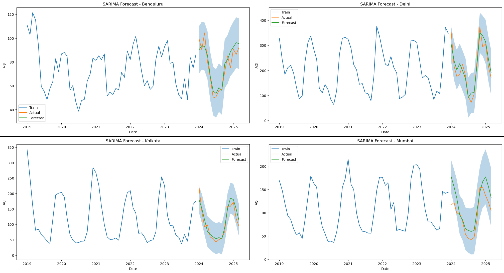

# AQI Forecasting and Diwali Impact Analysis
### An end-to-end time series analysis of Air Quality Index (AQI) data across 4 Indian cities, featuring exploratory data analysis, Diwali impact assessment, statistical testing, SARIMA forecasting, and an interactive Streamlit dashboard.

## Dashboard
[Live Streamlit App](https://aqi-forecasting-and-diwali-impact-analysis-cytpmwz95f6ujpmi85y.streamlit.app/)

## Dataset Source
Air Quality Index (AQI) data obtained from the Central Pollution Control Board (CPCB), India.

## Cities & Study Period
**Cities:** Bengaluru, Delhi, Kolkata, Mumbai
**Study Period:** January 2019 - March 2025

## Objectives
- Explore AQI patterns across major Indian metropolitan cities
- Analyze the impact of Diwali celebrations on air quality
- Investigate seasonality and trends
- Develop and evaluate SARIMA forecasting models

## Repository Structure
- `data/`  cleaned data files
- `scripts/`  Python analysis scripts
- `plots/`  all visualisation outputs
- `results/`  result CSVs and text files
- `streamlit_app/`  interactive dashboard

## Analysis Pipeline

1. **Data Cleaning and Exploratory Data Analysis**
   * Data preprocessing and validation
   * AQI distribution analysis
   * Daily, monthly, and annual trend analysis

2. **Diwali Event Study**
   * Event-window analysis around Diwali
   * Impact score computation
   * Mann–Whitney U significance testing

3. **Time Series Analysis**
   * STL decomposition
   * ADF and KPSS stationarity testing
   * ACF/PACF analysis
   * OCSB test and Canova-Hansen test

4. **Forecasting and Validation**
   * SARIMA model selection using AIC
   * Train-Test forecasting (2019–2023 → 2024–2025)
   * Residual diagnostics and Ljung-Box testing
   * Forecast accuracy evaluation

## SARIMA Forecasting

## Forecast Performance
| City | MAE | RMSE | MAPE (%) | R² |
|------|------|------|------|------|
| Bengaluru | 5.45 | 6.72 | 6.96 | 0.8475 |
| Delhi | 24.43 | 28.04 | 13.26 | 0.8949 |
| Kolkata | 15.84 | 19.26 | 15.45 | 0.8657 |
| Mumbai | 22.47 | 27.08 | 24.95 | 0.4592 |

## Key Findings
- Delhi consistently recorded the highest AQI levels among the four cities, while Bengaluru generally maintained the best air quality
- Strong annual seasonality was observed across all cities, with AQI peaking during winter months and improving during monsoon periods
- Diwali periods were associated with substantial AQI increases, particularly in Delhi and Mumbai
- SARIMA models successfully captured long-term trends and seasonal patterns in AQI data
- Forecasting performance was strongest for Delhi, followed by Kolkata and Bengaluru, while Mumbai's coastal dynamics limit SARIMA forecast accuracy
